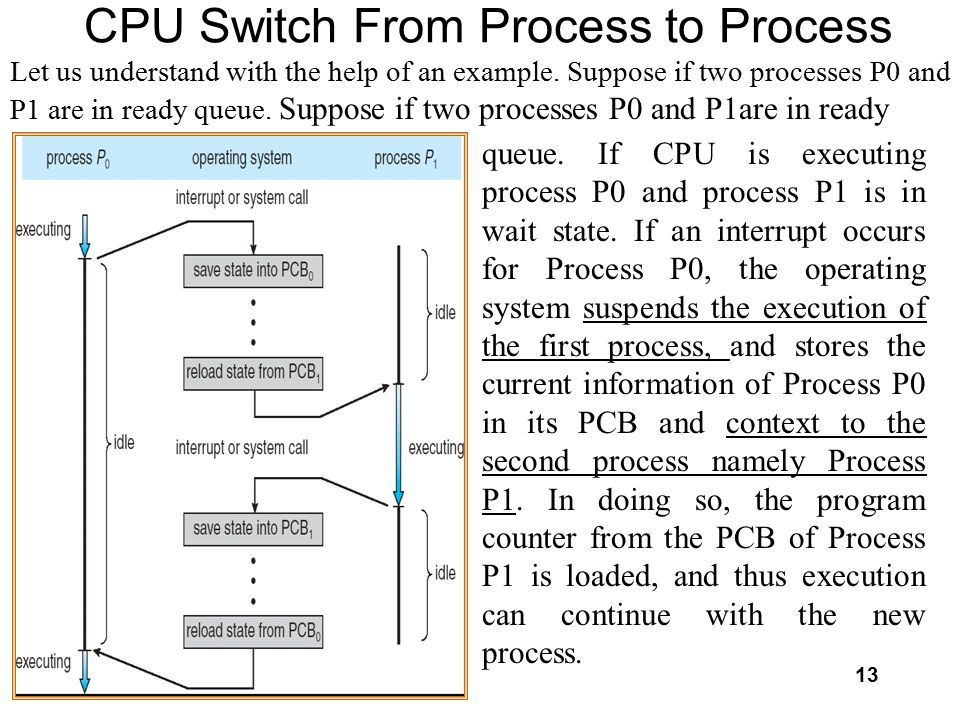

# Measuring execution time/speed of Python codes

You can use the time module in Python to measure the actual execution speed/time taken by the program. 

NOTE: We are only looking at ways to measure spped and not optimize....optimization part is foucsed on DSA-PS >> IQs esp based on complexity of code

### **Is execution time always constant for a code given the same input?**
If you execute the same code with the same input multiple times, the execution time may **vary slightly** due to various factors such as CPU usage, background processes, and system load. However, the execution time should be relatively consistent for the same code with the same input. >> Reason being is CPU actually dont multitask but do one thing at a time....it just switches between tasks/processes

To get a more accurate estimate of the average execution time, you can run the code multiple times and calculate the average execution time over those runs.

 

## speedtest.py
Contains 2 ways to measure exe time
1. Use decorator and define the decorator function >> apply on funcs
2. Use on particular blocks in std way of start and stop time >> esp with non user defined funcs like built in or imported

This code calculates number of sundays in a month or any no of days.... one done over loop while other optimized to ignore loop since
looping over large numbers is not takes a lot of time.
